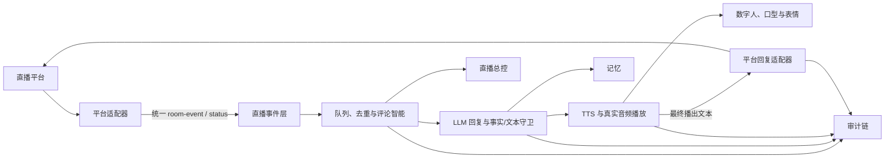
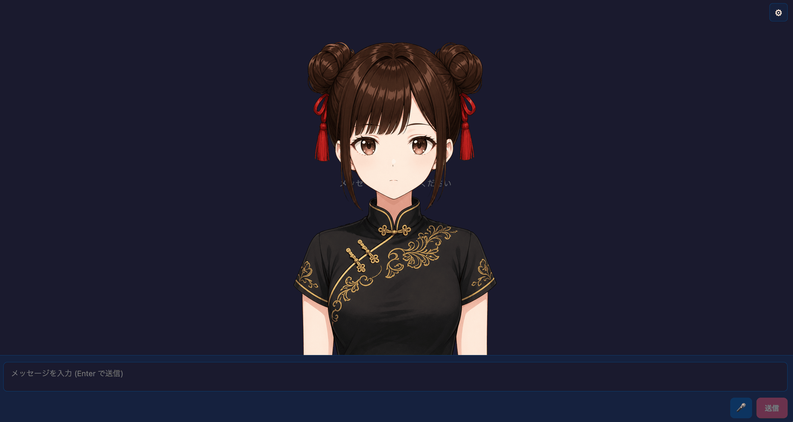
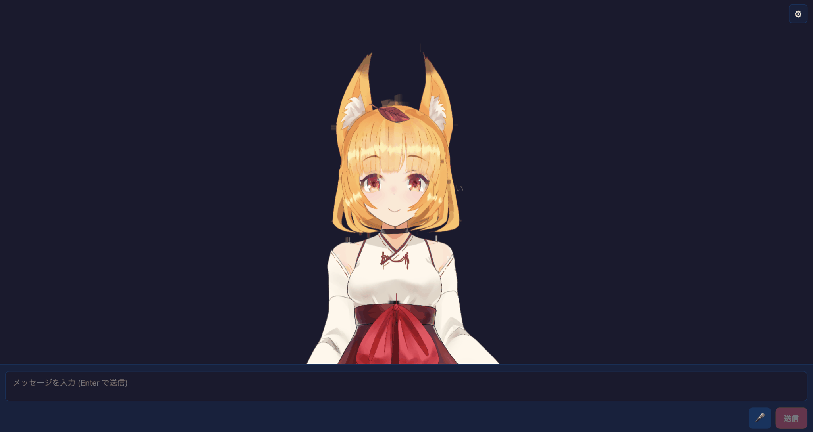
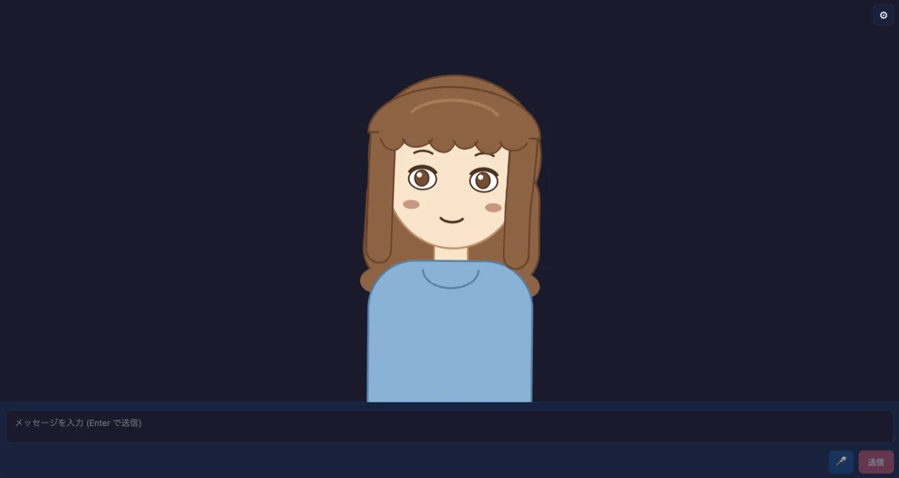

# AITuber OnAir

[](https://github.com/shinshin86/aituber-onair/actions/workflows/ci.yml)
[](https://deepwiki.com/shinshin86/aituber-onair)


[日本語版はこちら](./README_ja.md)

## 凌岚数字主播运行版

本仓库在 AITuber OnAir 的模块化能力上，提供了一套可实际运行的中文数字主播系统。当前主运行界面位于
[`packages/core/examples/react-purupuru-app`](./packages/core/examples/react-purupuru-app)，默认通过
`http://127.0.0.1:5173/` 打开直播总控。

它不只是“LLM + TTS + 一张会动的图片”，而是把直播输入、回复决策、语音播放、数字人表现、平台回写、记忆和审计串成一条可追踪的运行链：

- 接收直播间弹幕、礼物、醒目留言、点赞和进场等事件。
- 对输入进行排队、去重、风险过滤、上下文组装和回复调度。
- 在无弹幕互动持续超过两分钟时，根据直播状态规划主动搭话。
- 使用可替换的 LLM 和 TTS 服务生成回复与语音。
- 在真实音频播放时驱动 `.purupuru` / FlashHead 数字人表现和口型。
- 可将最终播出的文字同步回直播平台，并对重复发送、分段和限速进行保护。
- 记录观众输入、模型原始输出、清洗/事实校验、TTS、平台投递和总控操作，形成带哈希链的审计记录。
- 提供直播总控、待回复队列、手动播报、运行健康状态、记忆和压力测试入口。

### 当前运行架构



设计边界如下：

- **主播核心不认识具体平台。** 平台事件先归一化为 `LiveRoomEvent`，之后才进入队列和回复流程。
- **平台接收与平台发送分离。** 只需要读弹幕的平台可以只实现事件适配器；需要把主播文字发回平台时，再实现回复适配器。
- **头像渲染不依赖平台。** 更换 B 站、斗鱼或 Twitch 不应改动 TTS、口型和 `.purupuru` / FlashHead 链路。
- **凭据属于平台适配器。** Cookie、Token 和 API Key 不进入事件对象、浏览器日志或 Git。

### 快速启动

Windows 本地已完成依赖配置时，在本目录执行：

```powershell
# 只启动数字人、FlashHead 和直播总控
.\Start-AITuber.ps1 -OpenBrowser

# 启动 B 站网关后再启动数字人；首次传入房间号会保存配置
.\Start-Linglan-Bilibili.ps1 -RoomId <B站直播间号>
```

B 站凭据继续保存在仓库外层的 `.runtime/bilibili-auth.json`。需要录入或更新 Cookie 时，从本目录运行：

```powershell
powershell.exe -NoProfile -ExecutionPolicy Bypass `
  -File ..\.agents\skills\bilibili-live-automation\scripts\invoke-bilibili-automation.ps1 `
  -Action configure-auth
```

不要把 Cookie 粘贴进 README、聊天、环境变量示例或命令行参数。详细运维说明见
[B 站直播平台网关](./docs/bilibili-unattended-live.md)。

### 平台支持现状

| 平台/入口 | 接收直播消息 | 发送文字回平台 | 接入方式 |
| --- | --- | --- | --- |
| B 站 | 是 | 是 | OrdinaryRoad Java 驱动 + 本地统一网关 |
| YouTube | 是 | 当前运行版未统一回写 | 内置 YouTube Data API 适配 |
| Twitch | 是 | 当前运行版未统一回写 | 内置 EventSub 适配 |
| Social Stream Ninja | 是 | 否 | 外部消息总线，适合快速接入 Kick、TikTok 等平台 |
| 自定义 SSE | 是 | 需增加回复适配器 | 推荐的新平台标准接入点 |

“能够读到弹幕”和“能够以主播账号发回文字”是两种不同能力。切换平台前，应先确认目标平台是否提供官方 API、需要 OAuth 还是 Cookie、是否允许机器人发言，以及发送频率和内容审核限制。

## 更换或新增直播平台

### 路线一：使用已有的 YouTube 或 Twitch 适配

在直播总控中打开完整运行配置，进入 **Stream / 直播平台**：

1. 将平台切换为 YouTube 或 Twitch。
2. 填写该平台要求的直播 ID、API Key、Client ID 或 OAuth Token。
3. 启用对应平台监听。
4. 确认总控开始收到消息后，再进行主播回复测试。

同一平台通常只选择一个入站来源。B 站是明确支持的组合例外：可以由 Social Stream Ninja 接收入站消息，同时让 OrdinaryRoad 保持在线并负责文字回写；连接器路由会丢弃 OrdinaryRoad 的重复入站事件。当前 YouTube/Twitch 原生实现主要解决入站消息；若要同步发送主播文字，还需按下文实现 `LivePlatformReplyAdapter`。

### 路线二：使用 Social Stream Ninja 快速接入

如果目标平台已被 Social Stream Ninja 支持，可在总控的“平台与消息总线”中：

1. 启用 Social Stream Ninja。
2. 填写 Session ID 和消息总线地址。
3. 勾选由它负责的具体平台。
4. 除 B 站的“SSN 入站 + OrdinaryRoad 回写”组合外，关闭该平台的其他入站监听，避免双重消费。

这条路线适合先验证“能否收到消息并驱动主播回复”，但它不自动获得以主播账号向目标平台发言的能力。

### 路线三：为斗鱼等平台实现标准 SSE 桥

这是推荐的长期方案。平台桥可以使用 Node.js、Java、Python 或其他语言，只要向前端提供统一协议即可。前端已经提供
[`createCustomSseEventAdapter`](./packages/core/examples/react-purupuru-app/src/services/live-platform/customSse.ts)，因此只做入站接收时不需要修改主播核心。

平台桥至少提供：

```text
GET /events?client=<客户端标识>&lastEventId=<最后事件ID>
Content-Type: text/event-stream
```

每条直播事件使用 SSE 事件名 `room-event`：

```text
id: douyu:message-123
event: room-event
data: {"id":"douyu:message-123","type":"comment","text":"晚上好","timestamp":1750000000000,"author":{"id":"viewer-7","name":"观众甲"},"metadata":{"sourcePlatform":"douyu","roomId":"123456"}}
```

连接状态使用事件名 `status`：

```text
event: status
data: {"state":"online","isLive":true,"onlineCount":120}
```

统一事件字段定义位于
[`services/live-platform/types.ts`](./packages/core/examples/react-purupuru-app/src/services/live-platform/types.ts)。目前允许的 `type` 为：

- `comment`：普通弹幕或聊天消息
- `superchat`：付费醒目消息
- `gift`：礼物
- `guard`：舰长、订阅或会员类事件
- `follow`：关注
- `like`：点赞
- `entry`：观众进入直播间

平台桥必须满足以下规则：

- `id` 在平台和房间范围内稳定且唯一，重连后同一事件仍使用同一 ID。
- `timestamp` 使用 Unix 毫秒时间戳，不能用抓取程序启动时间代替消息时间。
- `author.id` 和 `author.name` 始终存在；匿名平台也应给出稳定的替代值。
- 平台原始字段放入 `metadata`，不要让平台专属对象泄漏到主播核心。
- 支持 `lastEventId` 重放或自行保证断线窗口不丢消息。
- 连接异常时发送 `status`，不要伪造空弹幕或让前端猜测连接状态。

桥启动后，在总控中选择“自定义 SSE 直播桥”，填入 `/events` 地址并启用即可。

### 如果还要把主播文字发回新平台

为目标平台实现与下面等价的发送接口：

```text
POST /send
Content-Type: application/json

{"message":"最终播出的文字","idempotencyKey":"speech:event-123"}
```

成功响应：

```json
{
  "ok": true,
  "duplicate": false,
  "chunksTotal": 1,
  "chunksSent": 1
}
```

然后实现
[`LivePlatformReplyAdapter`](./packages/core/examples/react-purupuru-app/src/services/live-platform/types.ts)，参考
[`bilibiliReplyAdapter`](./packages/core/examples/react-purupuru-app/src/services/live-platform/bilibili.ts)。回复适配器只负责把已经确定要播出的最终文本交给平台桥，不应重新调用 LLM 或 TTS。

完整的一等平台接入还需要：

1. 在 `StreamingPlatformOption` 和设置界面加入平台选项。
2. 创建该平台的事件适配器和可选回复适配器。
3. 在 `App.tsx` 中按设置选择适配器，不要复制整套回复流程。
4. 在 Vite 中配置本地反向代理，浏览器不直接持有平台密钥。
5. 将凭据保存在仓库外的 `.runtime` 文件或操作系统密钥存储中。
6. 为事件归一化、去重、断线重放、限速、幂等和凭据脱敏增加测试。

如果后续需要同时支持很多平台，应把“平台 ID → 事件适配器/回复适配器/配置描述”的映射收敛为注册表，而不是继续在 `App.tsx` 中增加大量平台分支。

### 新平台验收清单

- 健康状态明确区分 `starting`、`online`、`reconnecting` 和 `error`。
- 普通弹幕、礼物、关注/订阅和付费消息都能转换为正确事件类型。
- 断线重连不会漏掉窗口内事件，也不会重复回复同一事件。
- 主播自己的回写消息会被过滤，不形成自问自答循环。
- 只有真实 TTS 开始播放时才发送最终文本，不发送模型流式半成品。
- 长文本按目标平台限制切段并限速，失败后只继续未成功的分段。
- Cookie、OAuth Token、API Key 和 CSRF 不出现在前端状态、命令行、日志或审计正文中。
- 关闭回写开关后，平台监听和语音回复仍能独立工作。
- 在非直播状态完成模拟测试后，再由用户明确授权真实公开发言测试。

### 关键目录

```text
aituber-onair-main/
├── packages/core/examples/react-purupuru-app/
│   ├── src/services/live-platform/  # 前端平台事件/回复契约与适配器
│   ├── src/hooks/                   # 事件消费、主播核心、记忆与运行所有权
│   ├── src/components/ControlRoom.tsx
│   └── vite.config.ts               # 本地代理、审计与运行服务
├── scripts/
│   ├── live-platform-gateway.mjs    # 通用 HTTP/SSE、幂等、限速和审计网关
│   └── live-platform-gateway-common.mjs
├── tools/ordinaryroad-gateway/      # OrdinaryRoad B 站 Java 驱动
├── Start-AITuber.ps1                # 数字人和总控启动入口
├── Start-Linglan-Bilibili.ps1       # B 站组合启动入口
└── Run-Live-Platform-Gateway.ps1    # 当前直播平台网关守护入口
```

## 上游 AITuber OnAir 工具包说明

> **Build stream-ready AI VTubers with TypeScript**
>
> AITuber OnAir is an open source toolkit for building AI VTubers
> that can chat, speak, react to viewers, use memory, and run with
> PNG, VRM, or Live2D avatars. Start from the hosted web app, scaffold
> a starter app, self-host a working example, or assemble your own stack
> from modular TypeScript packages.

<p align="center">
  <a href="https://aituberonair.com">Try the hosted web app</a> ・
  <a href="./docs/quickstart.md">Quickstart</a> ・
  <a href="./docs/examples.md">Examples</a> ・
  <a href="./docs/avatar.md">Avatar Guide</a> ・
  <a href="#packages">Packages</a>
</p>


## What you can build

- AI VTubers that chat and speak with live viewers
- Streaming assistants that react to YouTube / Twitch comments
- AI character apps with text, voice, vision, and long-term memory
- Viewer relationship systems with points, levels, and achievements
- Browser- and Node.js-based integrations, composed from independent packages

## Start in 10 minutes

If you want the shortest path to a local AI VTuber:

```bash
npm create aituber-onair@latest my-aituber
cd my-aituber
npm run dev
```

Then open the app, choose a template, and configure your LLM / TTS provider
from **Settings**. See the [Quickstart](./docs/quickstart.md) for the full
walkthrough.

## Choose your path

### 1. Try the hosted web app

[AITuber OnAir](https://aituberonair.com) is a full, standalone AITuber streaming web app built on top of `@aituber-onair/core`. It's both the quickest way to experience the toolkit end-to-end and a working reference for what you can ship with it. No setup required.

### 2. Create a starter app

Use `create-aituber-onair` to scaffold your own app from an official PNGTuber,
VRM, or Live2D starter template.

```bash
npm create aituber-onair@latest
```

The CLI asks for a project name, template, and whether to install
dependencies. You can also pass the project name up front:

```bash
npm create aituber-onair@latest my-aituber
cd my-aituber
npm run dev
```

For step-by-step setup and template selection, see
[Quickstart](./docs/quickstart.md).

### 3. Run an example app locally

Full, ready-to-run React apps built on `@aituber-onair/core`. Pick the
avatar style that fits your project. All of them share the same broad LLM / TTS
provider coverage and in-app **Settings** UI.

#### PNGTuber Chat — 2D PNG avatar


Swap in 4 PNG states (mouth/eyes open/close) and get real-time lip-sync driven from actual audio output. See [`packages/core/examples/react-pngtuber-app`](./packages/core/examples/react-pngtuber-app).

```bash
git clone https://github.com/shinshin86/aituber-onair.git
cd aituber-onair/packages/core/examples/react-pngtuber-app
npm install
npm run dev
```

#### PuruPuru PNGTuber Chat — 2D avatar with hair physics



Load a single-file `.purupuru` avatar package and get idle motion, blinking,
audio-driven lip-sync, hair spring physics, idle gaze turns with pseudo-depth
parallax, and emotion-driven reactions — no camera or tracking required. Miko,
the official AITuber OnAir character, is bundled as the default avatar. The
avatar format and motion design were created by rotejin in
[PuruPuruPNGTuber](https://github.com/rotejin/PuruPuruPNGTuber); this example is
an AITuber-oriented reimplementation. See
[`packages/core/examples/react-purupuru-app`](./packages/core/examples/react-purupuru-app).

```bash
git clone https://github.com/shinshin86/aituber-onair.git
cd aituber-onair/packages/core/examples/react-purupuru-app
npm install
npm run dev
```

#### VRM Chat — 3D VRM avatar


Render a 3D VRM avatar (`miko.vrm`) with optional idle VRMA animation, real-time mouth lip-sync driven from audio output, and camera controls (drag to rotate / wheel to zoom). See [`packages/core/examples/react-vrm-app`](./packages/core/examples/react-vrm-app).

```bash
git clone https://github.com/shinshin86/aituber-onair.git
cd aituber-onair/packages/core/examples/react-vrm-app
npm install
npm run dev
```

#### Live2D Chat — local Live2D folder loader


<p align="center">
  <small>
    Live2D sample model: Hiyori Momose. Illustration: Kani Biimu;
    Modeling: Live2D Inc. This content uses sample data owned and copyrighted
    by Live2D Inc. See
    <a href="https://www.live2d.com/en/learn/sample/">Live2D Sample Data</a>.
  </small>
</p>

Load a local Live2D model folder that contains `.model3.json`, render it in
the browser, and drive mouth movement from actual audio output volume. This
example intentionally does not bundle any Live2D assets. See
[`packages/core/examples/react-live2d-app`](./packages/core/examples/react-live2d-app).

```bash
git clone https://github.com/shinshin86/aituber-onair.git
cd aituber-onair/packages/core/examples/react-live2d-app
npm install
npm run dev
```

#### Inochi2D Chat — Inochi2D avatar (experimental)



Render an Inochi2D avatar on a WebGL stage with a prebuilt Inochi2D runtime, and
drive mouth movement from actual audio output volume. This example bundles the
Aka Inochi2D model for first-run display, and you can also load a local `.inx` /
`.inp` file or register another model in `public/inochi2d/manifest.json`. See
[`packages/core/examples/react-inochi2d-app`](./packages/core/examples/react-inochi2d-app).

```bash
git clone https://github.com/shinshin86/aituber-onair.git
cd aituber-onair/packages/core/examples/react-inochi2d-app
npm install
npm run dev
```

#### Pet Chat — animated Codex Pet-style sprite


Render a Codex Pet-compatible spritesheet, move it around the stage, and switch
animations from chat state, reply mood, and real-time audio volume. See
[`packages/core/examples/react-pet-app`](./packages/core/examples/react-pet-app).

```bash
git clone https://github.com/shinshin86/aituber-onair.git
cd aituber-onair/packages/core/examples/react-pet-app
npm install
npm run dev
```

#### PSD Tachie Chat — PSDTool / Anime2.5DRig-compatible 2D tachie avatar



Load a single PSD file at runtime, composite PSD layers on canvas, and drive
mouth/eye layers with real-time lip-sync and blinking. Supports both
PSDTool-style leading `!` forced-visible / leading `*` radio layers and
Anime2.5DRig-compatible layer names for motion mode. A bundled `sample.psd`
animates with zero setup. See
[`packages/core/examples/react-psd-app`](./packages/core/examples/react-psd-app).

```bash
git clone https://github.com/shinshin86/aituber-onair.git
cd aituber-onair/packages/core/examples/react-psd-app
npm install
npm run dev
```

Open `http://localhost:5173` in any case, then set API keys and provider options in **Settings**.

See [Examples](./docs/examples.md) for the full example map and recommended
starting points.

### 4. Build your own with the packages

Install only what you need and drop it into your own app:

```bash
npm install @aituber-onair/chat
```

```ts
import { ChatServiceFactory } from '@aituber-onair/chat';

const chat = ChatServiceFactory.createChatService('openai', {
  apiKey: process.env.OPENAI_API_KEY!,
});

await chat.processChat(
  [{ role: 'user', content: 'Hello!' }],
  (partial) => process.stdout.write(partial),
  async (full) => console.log('\nDone:', full),
);
```

See each package README for provider setup and fuller usage.

## Documentation

- [Quickstart](./docs/quickstart.md): create a starter app, pick a template,
  configure providers, and run locally.
- [Examples](./docs/examples.md): choose from full AI VTuber apps, package
  examples, bot examples, and local runtime examples.
- [Avatar Guide](./docs/avatar.md): choose avatar styles and expand avatar
  expressions for richer AI character presentation.

## Packages

### [create-aituber-onair](./packages/create-aituber-onair/README.md)

<p align="center">
  
</p>

CLI for creating an AITuber OnAir app from an official starter template.
Currently includes PNGTuber, VRM, Live2D, and Pet templates. PNGTuber,
VRM, and Pet include starter assets; Live2D does not bundle Live2D model
assets.
```bash
npm create aituber-onair@latest
```

### [@aituber-onair/core](./packages/core/README.md)

<p align="center">
  
</p>

Core runtime tying chat, voice, memory, and conversation context together for full AITuber experiences.
```bash
npm install @aituber-onair/core
```

### [@aituber-onair/chat](./packages/chat/README.md)

<p align="center">
  
</p>

Unified LLM layer across OpenAI, Claude, Gemini, Z.ai, Kimi, DeepSeek, Mistral, and OpenRouter — streaming, tool/function calling, vision, and MCP support included.
```bash
npm install @aituber-onair/chat
```

### [@aituber-onair/voice](./packages/voice/README.md)

<p align="center">
  
</p>

Standalone TTS library with VOICEVOX, VoicePeak, OpenAI TTS, MiniMax, AIVIS Speech, and more, plus emotion-aware synthesis.
```bash
npm install @aituber-onair/voice
```

### [@aituber-onair/manneri](./packages/manneri/README.md)

<p align="center">
  
</p>

Detects repetitive conversation patterns and injects topic-diversification prompts to keep dialogue fresh.
```bash
npm install @aituber-onair/manneri
```

### [@aituber-onair/noise](./packages/noise/README.md)

<p align="center">
  
</p>

Post-generation rewrite engine that keeps AI character replies from landing too safely: detects predictable phrasing, builds structured friction, asks an LLM for rewrite candidates, and selects the safest non-generic response.
```bash
npm install @aituber-onair/noise
```

### [@aituber-onair/comment-intelligence](./packages/comment-intelligence/README.md)

<p align="center">
  
</p>

Filters live comments before they reach an AI character: selects one comment to answer, blocks unsafe input, summarizes ignored comments, and builds compact LLM context. Rules-first with optional LLM-assisted analysis.
```bash
npm install @aituber-onair/comment-intelligence
```

### [@aituber-onair/live-companion](./packages/live-companion/README.md)

Live-stream-specific five-dimensional memory, known-viewer presence tracking,
quiet-room proactive talk planning, and an avatar-neutral emotion/action
protocol. Platform, storage, LLM, and renderer integrations remain replaceable
adapters.
```bash
npm install @aituber-onair/live-companion
```

### [@aituber-onair/bushitsu-client](./packages/bushitsu-client/README.md)

<p align="center">
  
</p>

WebSocket chat client with React hooks, auto-reconnect, rate limiting, mentions, and voice integration. Browser and Node.js.
```bash
npm install @aituber-onair/bushitsu-client
```

### [@aituber-onair/kizuna](./packages/kizuna/README.md)

<p align="center">
  
</p>

Relationship / bond system (絆) for AI characters and viewers: points, achievements, emotion-based bonuses, level progression, persistent storage.
```bash
npm install @aituber-onair/kizuna
```

## Why AITuber OnAir

- Proven in production — powers [AITuber OnAir](https://aituberonair.com), a live AITuber streaming web app, so you're building on the same code path a real product ships on
- Pick any entry point: hosted web app, starter CLI, self-hosted example, or modular npm packages
- First-class coverage of the providers AITuber builders actually use — OpenAI / Claude / Gemini for chat, VOICEVOX / OpenAI TTS / AIVIS Speech and more for voice
- Chat, voice, streaming (YouTube / Twitch / WebSocket), and viewer relationships in a single, consistent stack
- MIT-licensed TypeScript — you keep control of hosting, data, and integrations

## Project structure

```txt
aituber-onair/
└── packages/
    ├── create-aituber-onair/ # npm create CLI with starter templates
    ├── core/             # AITuberOnAirCore, memory, orchestration
    ├── chat/             # LLM providers, streaming, tools, MCP
    ├── voice/            # TTS engines, emotion, playback
    ├── manneri/          # Conversation pattern detection
    ├── noise/            # Post-generation response rewriting
    ├── comment-intelligence/ # Live comment filtering and context building
    ├── live-companion/    # Live memory, proactive talk, avatar protocol
    ├── bushitsu-client/  # WebSocket chat client + React hooks
    └── kizuna/           # Viewer relationship / bond system
```

## License

MIT — see [LICENSE](./LICENSE).

## Special Thanks

This project is based on [the work referenced here](https://x.com/shinshin86/status/1862806042603847905). Without the contributions of these pioneers, it would not exist.

---

## For contributors

Working on the monorepo itself:

```bash
git clone https://github.com/shinshin86/aituber-onair.git
cd aituber-onair
npm install
npm run build
npm run test
npm run fmt
```

### Agent Skills

Shared Agent Skills so Codex and Claude Code use the same workflow definitions.
See [`docs/agent-skills.md`](./docs/agent-skills.md) for the full guide. Canonical sources live in `skills/`, with Claude Code runtime copies under `.claude/skills/`.

### Releases

Releases are driven by manual version bumps + per-package `CHANGELOG.md`, published automatically by GitHub Actions on merge to `main`. Do **not** run `npm publish` directly.

- **Patch**: bug fixes, dependency updates
- **Minor**: new features, backward-compatible changes
- **Major**: breaking changes to public API

`release.yml` uses Changesets to publish packages, create tags (`@aituber-onair/<pkg>@x.y.z`), and create GitHub Releases for packages published in that run. If CI fails mid-run, re-running publishes the remainder but does **not** backfill Releases for already-published packages — create those manually from the package CHANGELOG (tag will already exist). `prerelease-next.yml` only updates the `next` prerelease tag.
